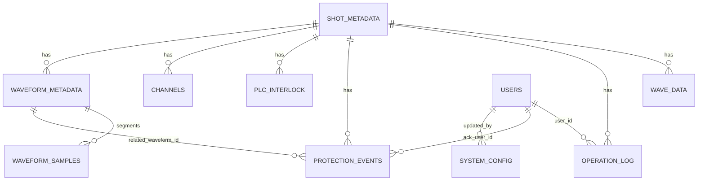
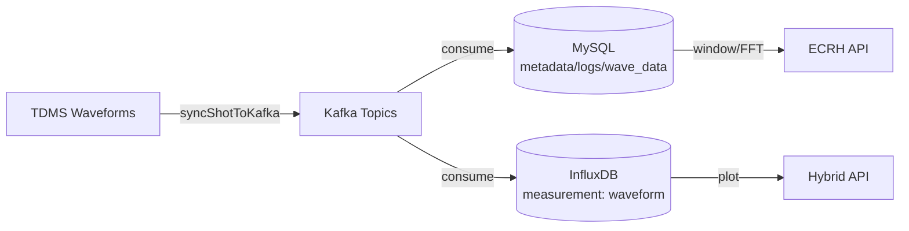

# Database Design (MySQL + InfluxDB)

**Scope**: Current runtime schema derived from JPA entities and InfluxDB writer logic. The actual DDL is managed by Spring JPA (`spring.jpa.hibernate.ddl-auto=update`), so column types follow Hibernate/MySQL defaults. The tables and fields below reflect the code definitions in `src/main/java/com/example/kafka/entity` and `src/main/java/com/example/kafka/service/InfluxDBService.java`.

## Storage Roles

**MySQL (structured + compressed waveforms)**
- Metadata, logs, protection events, PLC interlocks
- Compressed waveforms for window/FFT processing
- Waveform segment metadata + segments for fast window playback

**InfluxDB (time-series waveform points)**
- High‑volume per‑sample waveform storage
- Query optimized for plotting and downsampling

## MySQL Tables

### Summary

| Table | Purpose | Primary Key | Key Indexes / Unique |
|---|---|---|---|
| `shot_metadata` | Shot-level metadata | `shot_no` | (PK only) |
| `wave_data` | Compressed full waveform per channel | `id` | `idx_wave_shot_channel (shot_no, channel_name, data_type)` |
| `operation_log` | Operation logs (audit) | `id` | `idx_oplog_shot`, `idx_oplog_time`, `idx_oplog_user_time`, `idx_oplog_device_time` |
| `protection_events` | Protection/Interlock events | `event_id` | `idx_pe_shot_time`, `idx_pe_device_time`, `idx_pe_name_time`, `idx_pe_severity_time` |
| `plc_interlock` | PLC interlock records | `id` | `idx_plc_shot`, `idx_plc_time` |
| `channels` | Channel catalog per shot | `id` | Unique `(shot_no, channel_name, data_type)` |
| `waveform_metadata` | Per‑channel waveform metadata | `waveform_id` | Unique `(shot_no, device_id, channel_name)`, `idx_wave_shot_time`, `idx_wave_device_time` |
| `waveform_samples` | Segmented waveform samples | `sample_id` | Unique `(waveform_id, segment_index)`, `idx_seg_wave_time`, `idx_seg_shot_time` |
| `users` | Users for audit/ownership | `user_id` | `idx_user_role`, `idx_user_last_login`, unique `username` |
| `system_config` | Versioned config entries | `config_key` | `idx_cfg_scope_time` |

### `shot_metadata`

Purpose: shot/pulse metadata parsed from TDMS logs.

| Column | Type | Nullable | Notes |
|---|---|---|---|
| `shot_no` | INT | No | Primary key |
| `file_name` | VARCHAR | Yes | Filename if available |
| `file_path` | VARCHAR | Yes | TDMS path |
| `start_time` | DATETIME | Yes | Shot start time |
| `end_time` | DATETIME | Yes | Shot end time |
| `expected_duration` | DOUBLE | Yes | Planned duration |
| `actual_duration` | DOUBLE | Yes | Actual duration |
| `status` | VARCHAR | Yes | Completion status |
| `reason` | VARCHAR | Yes | Status reason |
| `tolerance` | DOUBLE | Yes | Tolerance value |
| `total_samples` | INT | Yes | Sample count |
| `sample_rate` | DOUBLE | Yes | Hz |
| `source_type` | ENUM | Yes | `FILE` / `NETWORK` |
| `created_at` | DATETIME | Yes | Set on insert |
| `updated_at` | DATETIME | Yes | Set on update |

### `wave_data`

Purpose: compressed full waveform for a single channel.

| Column | Type | Nullable | Notes |
|---|---|---|---|
| `id` | BIGINT | No | Primary key |
| `shot_no` | INT | No | Shot number |
| `channel_name` | VARCHAR | No | Channel name |
| `data_type` | VARCHAR | Yes | `Tube` / `Water` |
| `start_time` | DATETIME | Yes | Start time |
| `end_time` | DATETIME | Yes | End time |
| `sample_rate` | DOUBLE | Yes | Hz |
| `samples` | INT | Yes | Sample count |
| `data` | LONGBLOB | Yes | GZIP‑compressed samples |
| `file_source` | VARCHAR | Yes | TDMS file path |
| `source_type` | ENUM | Yes | `FILE` / `NETWORK` |
| `created_at` | DATETIME | Yes | Insert time |

Indexes:
- `idx_wave_shot_channel (shot_no, channel_name, data_type)`

### `operation_log`

Purpose: operation audit log entries (manual or TDMS‑derived).

| Column | Type | Nullable | Notes |
|---|---|---|---|
| `id` | BIGINT | No | Primary key |
| `shot_no` | INT | No | Shot number |
| `timestamp` | DATETIME | Yes | Operation time |
| `operation_type` | VARCHAR | Yes | e.g., `COMMAND`, `TDMS_STEP` |
| `user_id` | BIGINT | Yes | Logical FK to `users.user_id` |
| `device_id` | VARCHAR | Yes | Device identifier |
| `command` | VARCHAR | Yes | Command name |
| `parameters` | TEXT | Yes | JSON string |
| `result_code` | VARCHAR | Yes | `OK` / `ERROR` |
| `result_message` | VARCHAR | Yes | Details |
| `source` | VARCHAR | Yes | `GENERATOR`, `TDMS_DERIVED`, `UI`, ... |
| `correlation_id` | VARCHAR | Yes | Trace ID |
| `channel_name` | VARCHAR | Yes | Channel name |
| `step_type` | VARCHAR | Yes | `AUTO` / `MANUAL` |
| `old_value` | DOUBLE | Yes | Old value |
| `new_value` | DOUBLE | Yes | New value |
| `delta` | DOUBLE | Yes | Delta |
| `confidence` | DOUBLE | Yes | Confidence score |
| `file_source` | VARCHAR | Yes | TDMS file path |
| `source_type` | ENUM | Yes | `FILE` / `NETWORK` |
| `created_at` | DATETIME | Yes | Insert time |

Indexes:
- `idx_oplog_shot (shot_no)`
- `idx_oplog_time (timestamp)`
- `idx_oplog_user_time (user_id, timestamp)`
- `idx_oplog_device_time (device_id, timestamp)`

### `protection_events`

Purpose: protection/interlock events with trigger and action info.

| Column | Type | Nullable | Notes |
|---|---|---|---|
| `event_id` | BIGINT | No | Primary key |
| `shot_no` | INT | No | Shot number |
| `trigger_time` | DATETIME | No | Event time |
| `device_id` | VARCHAR | Yes | Device identifier |
| `severity` | VARCHAR | No | `INFO` / `TRIP` / `CRITICAL` |
| `protection_level` | VARCHAR | No | `FAST` / `LOW` |
| `interlock_name` | VARCHAR | No | Event name |
| `trigger_condition` | VARCHAR | Yes | Expression |
| `measured_value` | DOUBLE | Yes | Measured value |
| `threshold_value` | DOUBLE | Yes | Threshold |
| `threshold_op` | VARCHAR | Yes | `>=`, `>` etc |
| `action_taken` | VARCHAR | Yes | Action |
| `action_latency_us` | BIGINT | Yes | Latency (us) |
| `ack_user_id` | BIGINT | Yes | Logical FK to `users.user_id` |
| `ack_time` | DATETIME | Yes | Acknowledged time |
| `related_waveform_id` | BIGINT | Yes | Logical FK to `waveform_metadata.waveform_id` |
| `window_start` | DATETIME | Yes | Window start |
| `window_end` | DATETIME | Yes | Window end |
| `related_channels` | TEXT | Yes | JSON string |
| `raw_payload` | TEXT | Yes | Original payload |
| `created_at` | DATETIME | Yes | Insert time |

Indexes:
- `idx_pe_shot_time (shot_no, trigger_time)`
- `idx_pe_device_time (device_id, trigger_time)`
- `idx_pe_name_time (interlock_name, trigger_time)`
- `idx_pe_severity_time (severity, trigger_time)`

### `plc_interlock`

Purpose: PLC interlock records.

| Column | Type | Nullable | Notes |
|---|---|---|---|
| `id` | BIGINT | No | Primary key |
| `shot_no` | INT | No | Shot number |
| `timestamp` | DATETIME | Yes | Event time |
| `interlock_name` | VARCHAR | Yes | Interlock name |
| `status` | BOOLEAN | Yes | True=OK False=Trip |
| `current_value` | DOUBLE | Yes | Measured value |
| `threshold` | DOUBLE | Yes | Threshold |
| `threshold_operation` | VARCHAR | Yes | Operator |
| `description` | VARCHAR(1000) | Yes | Text |
| `additional_data` | TEXT | Yes | JSON |
| `source_type` | ENUM | Yes | `FILE` / `NETWORK` |
| `created_at` | DATETIME | Yes | Insert time |

Indexes:
- `idx_plc_shot (shot_no)`
- `idx_plc_time (timestamp)`

### `channels`

Purpose: per-shot channel registry and sampling summary.

| Column | Type | Nullable | Notes |
|---|---|---|---|
| `id` | BIGINT | No | Primary key |
| `shot_no` | INT | No | Shot number |
| `channel_name` | VARCHAR | No | Channel name |
| `data_type` | VARCHAR | No | `Tube` / `Water` |
| `data_points` | INT | Yes | Sample count |
| `sample_interval` | DOUBLE | Yes | Seconds per sample |
| `unit` | VARCHAR | Yes | Unit |
| `ni_name` | VARCHAR | Yes | NI alias |
| `file_source` | VARCHAR | Yes | TDMS file path |
| `last_updated` | DATETIME | Yes | Update time |

Unique constraint:
- `(shot_no, channel_name, data_type)`

### `waveform_metadata`

Purpose: per‑channel waveform metadata (time bounds, sampling).

| Column | Type | Nullable | Notes |
|---|---|---|---|
| `waveform_id` | BIGINT | No | Primary key |
| `shot_no` | INT | No | Shot number |
| `system_name` | VARCHAR | No | System name |
| `device_id` | VARCHAR | No | Device ID |
| `channel_name` | VARCHAR | No | Channel |
| `unit` | VARCHAR | Yes | Unit |
| `sample_rate_hz` | DOUBLE | Yes | Hz |
| `start_time` | DATETIME | No | Start time |
| `end_time` | DATETIME | No | End time |
| `total_samples` | BIGINT | Yes | Sample count |
| `tags` | TEXT | Yes | JSON string |
| `created_at` | DATETIME | Yes | Insert time |

Indexes / Unique:
- `uk_wave_shot_device_channel (shot_no, device_id, channel_name)`
- `idx_wave_shot_time (shot_no, start_time)`
- `idx_wave_device_time (device_id, start_time)`

### `waveform_samples`

Purpose: segmented waveform samples for window playback.

| Column | Type | Nullable | Notes |
|---|---|---|---|
| `sample_id` | BIGINT | No | Primary key |
| `waveform_id` | BIGINT | No | Logical FK to `waveform_metadata` |
| `shot_no` | INT | No | Shot number |
| `segment_index` | INT | No | Segment index |
| `segment_start_time` | DATETIME | No | Segment start |
| `segment_end_time` | DATETIME | No | Segment end |
| `start_sample_index` | BIGINT | No | Start sample offset |
| `sample_count` | INT | No | Samples in segment |
| `encoding` | VARCHAR | No | `gzip-f64` |
| `data_blob` | LONGBLOB | Yes | Compressed samples |
| `v_min` | DOUBLE | Yes | Segment min |
| `v_max` | DOUBLE | Yes | Segment max |
| `v_rms` | DOUBLE | Yes | Segment RMS |
| `created_at` | DATETIME | Yes | Insert time |

Indexes / Unique:
- `uk_seg_wave_index (waveform_id, segment_index)`
- `idx_seg_wave_time (waveform_id, segment_start_time)`
- `idx_seg_shot_time (shot_no, segment_start_time)`

### `users`

Purpose: audit identity reference for logs/config updates.

| Column | Type | Nullable | Notes |
|---|---|---|---|
| `user_id` | BIGINT | No | Primary key |
| `username` | VARCHAR | No | Unique |
| `display_name` | VARCHAR | Yes | Display name |
| `password_hash` | VARCHAR | No | Password hash |
| `role` | VARCHAR | No | Role label |
| `enabled` | BOOLEAN | No | Enabled flag |
| `last_login_at` | DATETIME | Yes | Last login |
| `created_at` | DATETIME | Yes | Insert time |

Indexes:
- `idx_user_role (role)`
- `idx_user_last_login (last_login_at)`

### `system_config`

Purpose: versioned configuration values.

| Column | Type | Nullable | Notes |
|---|---|---|---|
| `config_key` | VARCHAR | No | Primary key |
| `scope` | VARCHAR | No | Scope, e.g. `global` |
| `config_value` | TEXT | No | JSON string |
| `version` | BIGINT | No | Version number |
| `updated_by` | BIGINT | Yes | Logical FK to `users.user_id` |
| `updated_at` | DATETIME | Yes | Updated time |
| `comment` | VARCHAR | Yes | Comment |

Indexes:
- `idx_cfg_scope_time (scope, updated_at)`

## InfluxDB Schema

Measurement: `waveform`

Tags:
- `shot_no` (string)
- `channel_name` (string)
- `data_type` (string)
- `file_source` (string)

Fields:
- `value` (float)
- `sample_index` (int)

Timestamp:
- Derived from `start_time + sample_index / sample_rate`

Write path:
- Implemented in `InfluxDBService.writeWaveData()`

## Relationship Notes

- There are no explicit foreign key constraints in JPA; relations are logical.
- Logical references used in code:
  - `operation_log.user_id` → `users.user_id`
  - `protection_events.ack_user_id` → `users.user_id`
  - `protection_events.related_waveform_id` → `waveform_metadata.waveform_id`
  - `waveform_samples.waveform_id` → `waveform_metadata.waveform_id`

## ER Diagram (Logical)

## Storage Overview (MySQL vs InfluxDB)

## Compression

- `wave_data.data` and `waveform_samples.data_blob` store compressed waveform bytes.
- Compression helper: `com.example.kafka.util.WaveformCompression` (GZIP of double list).

## Query Paths

- Waveform plotting: `/api/hybrid/waveform` → InfluxDB
- FFT/window: `/api/ecrh/waveform/window` and `/api/ecrh/waveform/spectrum` → MySQL compressed waveforms
- Logs/events: `/api/ecrh/operation-logs` and `/api/ecrh/protection-events` → MySQL
